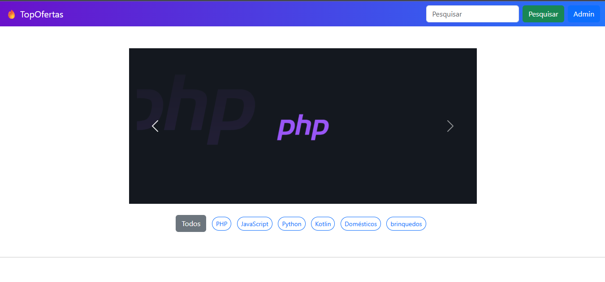
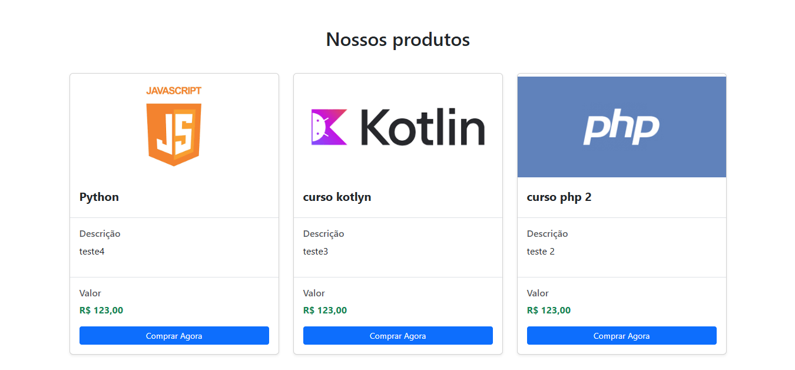

# 🔥 TopOfertas

Plataforma web de vendas de produtos e cursos online, desenvolvida em dupla com marcus. Permite que visitantes naveguem, filtrem e comprem produtos cadastrados incluindo cursos, itens domésticos e muito mais  com suporte a links de afiliados de plataformas como Mercado Livre, Amazon e similares, permitindo monetização através das vendas. Administradores gerenciam todo o catálogo pelo painel admin.
🔗 **Acesse o projeto online:** [topofertas.kesug.com](http://topofertas.kesug.com/)

> ⚠️ O certificado SSL está em processo de emissão. Caso o navegador exiba aviso de segurança, clique em "Avançado" e acesse normalmente.

---

## 📸 Screenshots

| Página inicial | Listagem de cursos |
|---|---|
|  |  |

---

## ✨ Funcionalidades

- 🎠 Banner carousel dinâmico na página inicial
- 🗂️ Filtro de cursos por categoria (PHP, JavaScript, Python, Kotlin e mais)
- 🔍 Busca de cursos por nome
- 🛍️ Cards de cursos com imagem, descrição e preço
- 🛠️ Painel administrativo para gerenciar cursos e categorias
- 🛡️ Proteção contra SQL Injection via prepared statements (MySQLi)

---

## 🛠️ Tecnologias utilizadas

- **PHP** (procedural, MySQLi)
- **MySQL**
- **HTML5 / CSS3**
- **JavaScript**

---

## 🚀 Como rodar o projeto localmente

```bash
# Clone o repositório
git clone https://github.com/heeenryy/TopOfertas.git

# Importe o banco de dados
# (o arquivo .sql está na raiz do projeto)

# Configure a conexão com o banco em config.php
# host, usuário, senha e nome do banco

# Suba o projeto no seu servidor local (Apache/WSL/XAMPP)
# e acesse via navegador
```

---

## 👥 Desenvolvedores

| [Henrique](https://github.com/heeenryy) | [Marcos Luan](https://github.com/mgnn-git) |
|---|---|
| Back-end & banco de dados | Front-end & layout |

---

## 📚 O que aprendemos com esse projeto

Primeiro projeto desenvolvido em dupla com controle de versão via Git/GitHub. Praticamos colaboração com branches, resolução de merge conflicts, e construímos uma plataforma completa com sistema de categorias, busca dinâmica e painel administrativo em PHP.
